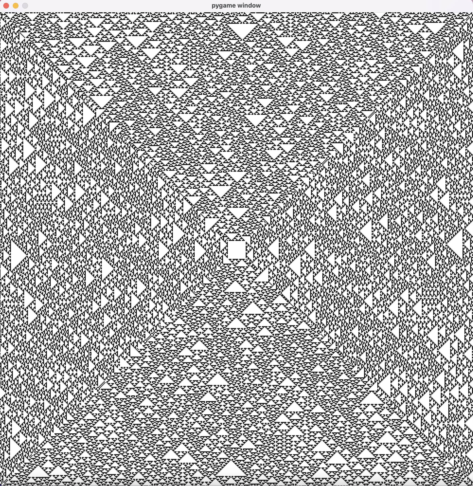
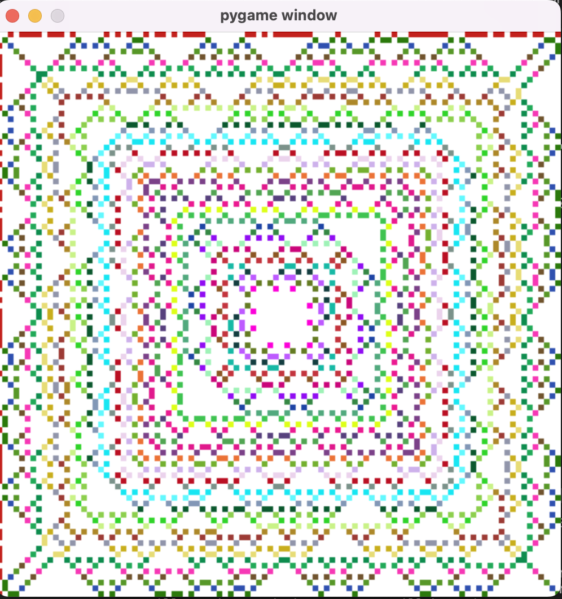

# ElementaryCellAutomata

My experiments on Elementary Cellular Automaton:\

Rule number 110 is Turing complete!

"There is an elementary cellular automaton (rule 110, defined below) which is capable of universal computation, and as such it is one of the simplest possible models of computation."\
https://en.wikipedia.org/wiki/Elementary_cellular_automaton

The automatons are replicated from all sides to create a very cool visualization!

...

...

...

