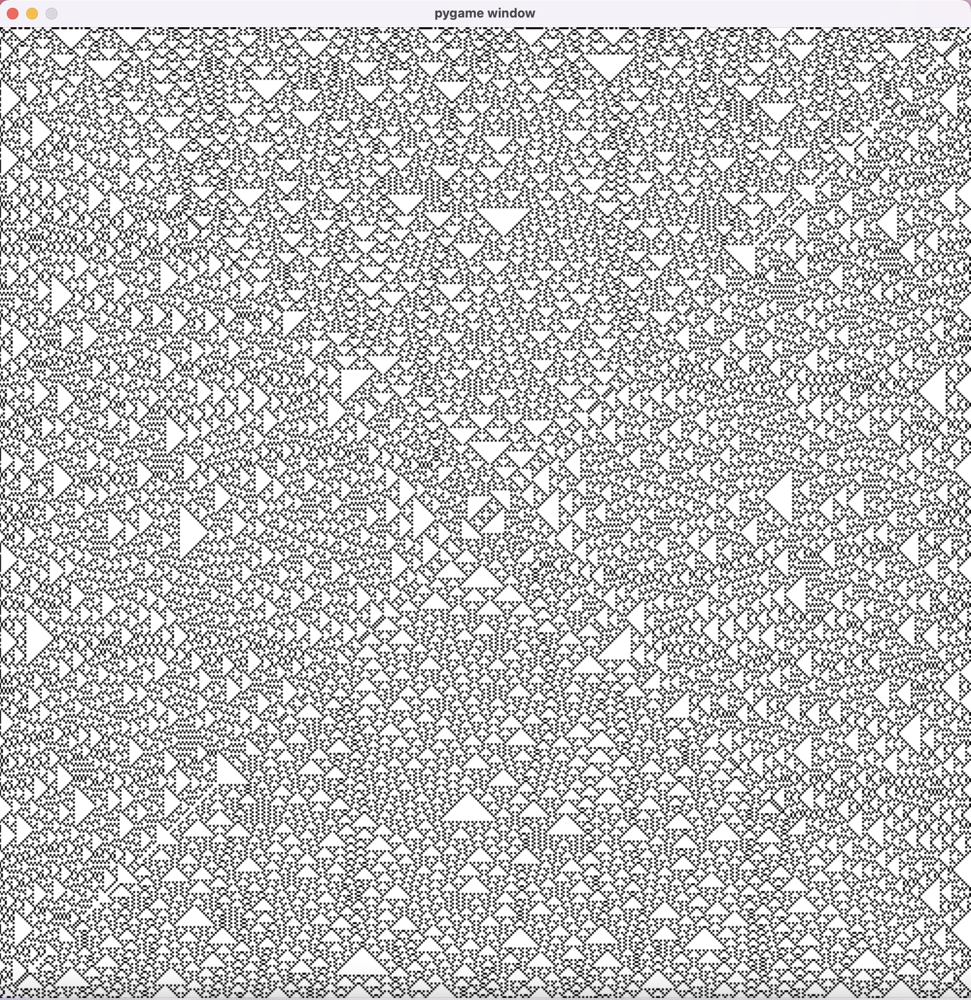

# ElementaryCellAutomata

My experiments on Elementary Cellular Automaton:\
https://en.wikipedia.org/wiki/Elementary_cellular_automaton

The automatons are replicated from all sides to create a very cool visualization!

...

...

...

